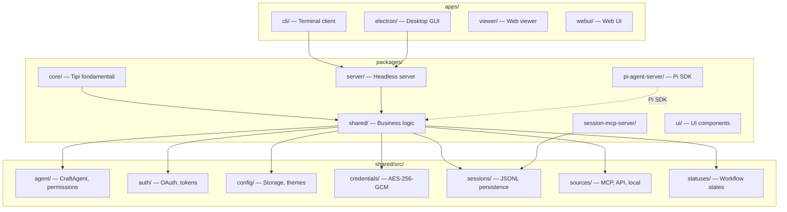
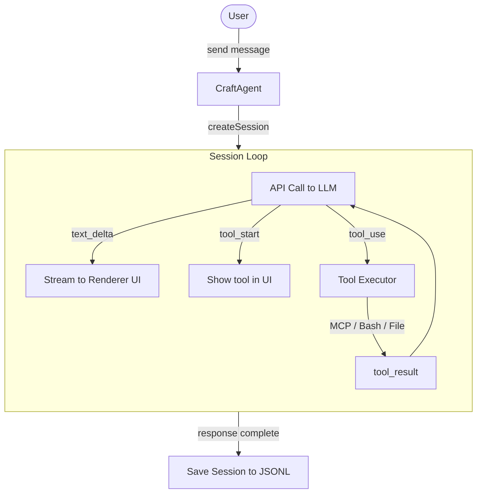
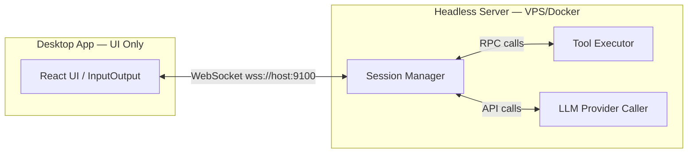

<!-- v1.1.0 - last updated: 2026-05-01 -->

# Architecture Overview — Come Funziona Craft Agents Dentro

Panoramica architetturale per sviluppatori che vogliono capire come è strutturato Craft Agents OSS.

---

## Indice

- [Com'è strutturato il monorepo?](#comè-strutturato-il-monorepo)
- [Cosa fa il package core vs shared?](#cosa-fa-il-package-core-vs-shared)
- [Come funziona il session loop?](#come-funziona-il-session-loop)
- [Cos'è il Pi SDK vs Claude Agent SDK?](#cosè-il-pi-sdk-vs-claude-agent-sdk)
- [Come funziona il sistema di permessi?](#come-funziona-il-sistema-di-permessi)
- [Come funziona la crittografia delle credenziali?](#come-funziona-la-crittografia-delle-credenziali)
- [Come funziona il thin-client mode (server remoto)?](#come-funziona-il-thin-client-mode-server-remoto)
- [Cos'è il protocol RPC?](#cosè-il-protocol-rpc)
- [Come funziona il sistema di documentazione built-in?](#come-funziona-il-sistema-di-documentazione-built-in)

---

## Com'è strutturato il monorepo?



### Electron App Architecture

```
┌──────────────────────┐
│    Main Process       │
│  (Node.js + esbuild)  │
│                      │
│ ┌─────────────────┐  │
│ │  CraftAgent SDK  │  │  ← Claude Agent SDK (bundlelizzato)
│ │  + Session Mgmt  │  │
│ └─────────────────┘  │
│         │             │
│    IPC Bridge         │  ← Context bridge
│         │             │
└─────────┬────────────┘
          │ preload
┌─────────▼────────────┐
│   Renderer Process    │
│  (React + shadcn/ui)  │
│                      │
│ ┌────────┐ ┌──────┐  │
│ │ ChatUI │ │Menu  │  │
│ └────────┘ └──────┘  │
│ ┌────────┐ ┌──────┐  │
│ │Settings│ │Diff  │  │
│ └────────┘ └──────┘  │
└──────────────────────┘
```

---

## Cosa fa il package core vs shared?

### `packages/core/`
- **Tipi fondamentali** condivisi tra tutti i package
- Interfacce base per agent, sessions, workspaces
- Definizioni dei tipi MCP

### `packages/shared/`
- **Business logic** principale
- Gestione sessioni (creazione, persistenza, caricamento)
- Configurazione e preferenze
- Crittografia credenziali
- Sistema di permessi
- Sources (MCP, API, locali)
- Skills, labels, mentions, automations
- Docs system (analizzato sotto)

**Regola pratica:** `core` = cosa sono le cose, `shared` = come funzionano.

---

## Come funziona il session loop?

Il **session loop** è il cuore dell'interazione con l'agente:



**Punti chiave:**
- Il loop è **stateful**: ogni sessione mantiene la cronologia
- I tool possono essere MCP, bash, filesystem — tutto è un tool
- Le risposte grandi vengono compresse automaticamente (>60KB)
- Sessioni multiple possono girare in parallelo (background tasks)

---

## Cos'è il Pi SDK vs Claude Agent SDK?

Craft Agents usa **due backends** AI side-by-side:

### Claude Agent SDK (`@anthropic-ai/claude-agent-sdk`)
- Usato per connessioni **Anthropic** (API key, Claude Max/Pro OAuth)
- Supporta custom base URLs (OpenRouter, Vercel AI Gateway, Ollama)
- Responsabile del session loop, tool execution, streaming
- Bundlelizzato nell'Electron main process (~950KB)

### Pi SDK (Pi agent server)
- Usato per connessioni **non-Anthropic**:
  - Google AI Studio
  - ChatGPT Plus/Pro (Codex OAuth)
  - GitHub Copilot OAuth
  - OpenAI API key
- Gira come server separato (`packages/pi-agent-server/`)
- Provider-specific routing attraverso la propria infrastruttura

**Come sceglie quale usare?**
- Se il provider è Anthropic → Claude Agent SDK
- Se il provider è Google/OpenAI/Copilot → Pi SDK

---

## Come funziona il sistema di permessi?

Il sistema ha **3 modalità** con comportamento progressivo:

### Modalità

| Mode | Nome UI | Comportamento |
|------|---------|---------------|
| `safe` | Explore | Read-only: blocca tutte le scritture |
| `ask` | Ask to Edit | Chiede approvazione per ogni azione (default) |
| `allow-all` | Auto | Auto-approva tutti i comandi |

### Implementazione
Definita in `packages/shared/src/agent/permissions/`:
- Hook `PreToolUse` e `PostToolUse` per intercettare ogni tool call
- Policy engine che decide se un tool è permesso, bloccato, o requires approval
- Regole personalizzabili per workspace

### UI
- Visibile nell'header della chat
- `Shift+Tab` per ciclare rapidamente
- Le richieste di approvazione appaiono come notifiche inline

---

## Come funziona la crittografia delle credenziali?

Le credenziali sono salvate in `~/.craft-agent/credentials.enc`:

- **Algoritmo**: AES-256-GCM (autenticato + cifrato)
- **Chiave**: derivata dal sistema (non una password utente)
- **Formato**: file binario cifrato, non leggibile direttamente
- **Contenuti**: OAuth tokens, API keys, secret di configurazione

**Vantaggi:**
- Le credenziali non sono mai in chiaro su disco
- Se qualcuno accede al file, non può leggerlo
- Trasparente per l'utente — l'agente gestisce tutto

---

## Come funziona il thin-client mode (server remoto)?

Craft Agents può funzionare in due modalità:

### Locale (default)
Tutto gira sulla tua macchina: UI + session loop + tool execution.

### Thin-Client (server remoto)



**Setup:**
```bash
# Server remoto
CRAFT_SERVER_TOKEN=$(openssl rand -hex 32) bun run packages/server/src/index.ts

# Desktop si connette
CRAFT_SERVER_URL=wss://203.0.113.5:9100 CRAFT_SERVER_TOKEN=<token> bun run electron:start
```

**Vantaggi:**
- Sessioni persistono anche se chiudi il client
- Accessibile da più macchine
- Compute pesante sul server

---

## Cos'è il protocol RPC?

Il **RPC protocol** è il layer di comunicazione tra client e server remoto:

- **Transport**: WebSocket (`ws://` o `wss://`)
- **Auth**: Bearer token (CRAFT_SERVER_TOKEN)
- **Formato**: JSON-based request/response
- **Canali**: pattern pub/sub per eventi push

**Comandi RPC:**
```
ping           → pong (verifica connessione)
session.create → session ID
session.send   → stream di eventi (text_delta, tool_start, etc.)
session.cancel → acknowledgement
```

**Client ufficiale:**
- CLI: `craft-cli` (Go-style commands)
- UI: Desktop app in thin-client mode
- Custom: qualsiasi client WebSocket JSON

---

## Come funziona il sistema di documentazione built-in?

Definito in `packages/shared/src/docs/`:

### Componenti

1. **`doc-links.ts`** — Record strutturato di link a documentazione
   - Ogni feature ha: path, title, summary
   - Usato per help popover nell'UI
   - Link punta a `https://agents.craft.do/docs/...`

2. **`source-guides.ts`** — Parsing guide per sources
   - Frontmatter YAML con domains/providers
   - Parse di knowledge e setupHints
   - Guide servite via MCP docs server

3. **`index.ts`** — Sincronizzazione docs
   - Carica docs da `~/.craft-agent/docs/`
   - Sincronizzati da bundled assets (`resources/docs/*.md`)
   - Auto-discovery: qualsiasi file in `resources/docs/` viene sincronizzato
   - Gestione graceful degradation (se docs non esistono, non crasha)

### Flusso
```
app/resources/docs/*.md
        │ sync (build time)
        ▼
~/.craft-agent/docs/
        │ load (runtime)
        ▼
packages/shared/src/docs/index.ts
        │ export
        ▼
UI help popover + agent context
```

---

**Vedi anche**:
- [Troubleshooting](troubleshooting.md) — problemi comuni
- [Contributing Guide](../CONTRIBUTING.md) — come contribuire
- [Quickstart](quickstart.md) — primi passi con l'app
- [Tips & Tricks](tips-and-tricks.md) — scorciatoie utili
