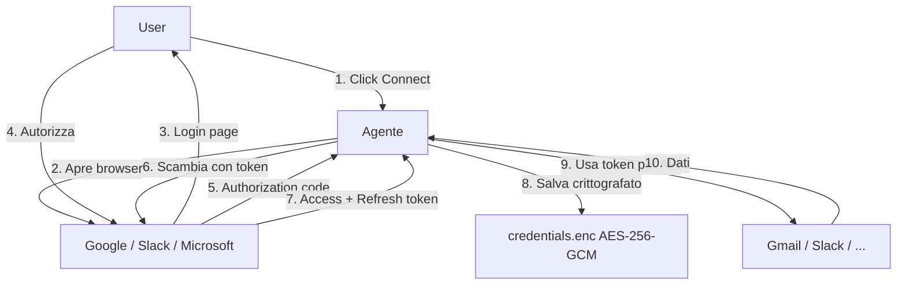

<!-- v1.1.0 - last updated: 2026-05-01 -->

# Sources Guide — Connettere il Mondo Esterno

Guida completa per connettere MCP server, API REST e filesystem locali a Craft Agents.

---

## Indice delle Domande

- [Cosa sono i sources e a cosa servono?](#cosa-sono-i-sources-e-a-cosa-servono)
- [Quali tipi di source esistono?](#quali-tipi-di-source-esistono)
- [Come connetto un MCP server pubblico?](#come-connetto-un-mcp-server-pubblico)
- [Come connetto un MCP server locale (stdio)?](#come-connetto-un-mcp-server-locale-stdio)
- [Quali variabili d'ambiente vengono filtrate per MCP locali?](#quali-variabili-dambiente-vengono-filtrate-per-mcp-locali)
- [Come passo una variabile d'ambiente a un MCP locale?](#come-passo-una-variabile-dambiente-a-un-mcp-locale)
- [Come connetto un'API REST (Gmail, Calendar, Slack)?](#come-connetto-unapi-rest-gmail-calendar-slack)
- [Come configuro Google OAuth?](#come-configuro-google-oauth)
- [Come connetto una cartella locale (Obsidian, git repo)?](#come-connetto-una-cartella-locale-obsidian-git-repo)
- [Come importo i miei MCP da Claude Code?](#come-importo-i-miei-mcp-da-claude-code)
- [Come funziona l'autenticazione OAuth?](#come-funziona-lautenticazione-oauth)
- [Dove vengono salvate le credenziali?](#dove-vengono-salvate-le-credenziali)

---

## Cosa sono i sources e a cosa servono?

I **sources** sono connessioni a servizi esterni che danno all'agente strumenti (tools) aggiuntivi. Ogni source espone un insieme di strumenti che l'agente può usare durante le conversazioni.

**Esempi:**
- Source GitHub → tools per leggere issue, PR, file
- Source Gmail → tools per leggere e inviare email
- Source filesystem locale → tools per leggere e scrivere file

---

## Quali tipi di source esistono?

| Tipo | Esempi | Come funziona |
|------|--------|---------------|
| **MCP Server** | GitHub, Linear, Notion, Craft | Si connette a un MCP server via HTTP o stdio |
| **API REST** | Gmail, Calendar, Slack, YouTube | Chiamate HTTP dirette con OAuth |
| **Filesystem locale** | Obsidian vault, git repo, cartella dati | Accesso diretto al filesystem locale |

---

## Come connetto un MCP server pubblico?

**Metodo più semplice** — basta chiedere all'agente:

```
Aggiungi GitHub come source
```

L'agente:
1. Cerca l'MCP server appropriato
2. Legge la documentazione
3. Guida nella configurazione delle credenziali
4. Attiva il source

**Metodo manuale**: se hai già un config JSON MCP, incollalo direttamente:
```
Configura questo MCP: { ... }
```

L'agente gestisce il resto.

---

## Come connetto un MCP server locale (stdio)?

Gli MCP server locali (stdio-based) girano come **subprocessi** sulla tua macchina.

**Esempio**: connettere un MCP Python locale
```
Aggiungi questo MCP locale:
comando: python
argomenti: [-m, mcp_server_package]
```

**Supported transports:**
- `stdio` — esegue un binario locale (npx, python, bun, ecc.)
- `http` / `streamable-http` — si connette a un server HTTP remoto

**Tips:**
- Il source locale viene avviato all'occorrenza dall'app
- Le variabili d'ambiente sensibili vengono **filtrate automaticamente** (vedi sotto)
- Puoi passare variabili specifiche con `env` nella configurazione

---

## Quali variabili d'ambiente vengono filtrate per MCP locali?

Per prevenire fughe di credenziali, queste variabili sono **bloccate** dall'essere passate ai subprocessi MCP:

- `ANTHROPIC_API_KEY`, `CLAUDE_CODE_OAUTH_TOKEN`
- `AWS_ACCESS_KEY_ID`, `AWS_SECRET_ACCESS_KEY`, `AWS_SESSION_TOKEN`
- `GITHUB_TOKEN`, `GH_TOKEN`
- `OPENAI_API_KEY`, `GOOGLE_API_KEY`
- `STRIPE_SECRET_KEY`, `NPM_TOKEN`

**NOTA**: se un MCP locale ha bisogno di una di queste, usa il campo `env` nella configurazione del source per passarla esplicitamente.

---

## Come passo una variabile d'ambiente a un MCP locale?

Usa il campo `env` nella configurazione del source:

```json
{
  "type": "mcp",
  "config": {
    "command": "npx",
    "args": ["-y", "@modelcontextprotocol/server-github"],
    "env": {
      "GITHUB_TOKEN": "il-tuo-token"
    }
  }
}

```

Basta descrivere all'agente cosa ti serve e lui configura correttamente.

---

## Come connetto un'API REST (Gmail, Calendar, Slack)?

Craft Agents supporta connessioni OAuth per servizi Google, Microsoft e Slack.

**Esempio**: connettere Gmail
```
Collega la mia Gmail
```

L'agente:
1. Ti chiede di creare un Google Cloud Project (se non ce l'hai)
2. Guida nell'abilitare APIs necessarie
3. Configura l'OAuth consent screen
4. Genera OAuth Client ID e Secret
5. Apre il browser per il login Google
6. Attiva il source

**Servizi supportati:**
- **Google**: Gmail, Calendar, Drive, YouTube, Search Console
- **Microsoft**: Outlook, Calendar, OneDrive, Teams, SharePoint
- **Slack**: Messaggi, canali, file

---

## Come configuro Google OAuth?

### 1. Crea un Google Cloud Project
1. Vai su [Google Cloud Console](https://console.cloud.google.com)
2. Crea un nuovo progetto
3. Appunti il Project ID

### 2. Abilita le API necessarie
Vai a **APIs & Services → Library** e abilita:
- Gmail API
- Google Calendar API
- Google Drive API
- (a seconda di cosa ti serve)

### 3. Configura OAuth Consent Screen
1. **APIs & Services → OAuth consent screen**
2. Seleziona **External**
3. Compila: nome app, email supporto, contatto sviluppatore
4. Aggiungi te stesso come test user
5. Completa il wizard

### 4. Crea OAuth Credentials
1. **APIs & Services → Credentials**
2. **Create Credentials → OAuth Client ID**
3. Tipo: **Desktop app**
4. Appunti **Client ID** e **Client Secret**

### 5. Configura in Craft Agents
Quando configuri il source, fornisci Client ID e Secret:
```json
{
  "api": {
    "googleService": "gmail",
    "googleOAuthClientId": "tuo-client-id.apps.googleusercontent.com",
    "googleOAuthClientSecret": "tuo-client-secret"
  }
}
```

Oppure lascia che l'agente ti guidi passo-passo.

---

## Come connetto una cartella locale (Obsidian, git repo)?

**Esempio**: connettere un vault Obsidian
```
Aggiungi la cartella ~/Obsidian come source locale
```

L'agente configura l'accesso alla directory e ottiene tools per:
- Leggere file
- Cercare contenuti
- Elencare directory

**Casi d'uso comuni:**
- **Obsidian vault**: query笔记, collegamenti
- **Git repository**: esplorare codice, leggere file
- **Cartella documenti**: cercare PDF, documenti
- **Download**: organizzare file scaricati

---

## Come importo i miei MCP da Claude Code?

Se hai già configurato MCP server in Claude Code, puoi importarli:

```
Importa i miei MCP server da Claude Code
```

L'agente troverà la configurazione esistente e la importerà automaticamente.

---

## Come funziona l'autenticazione OAuth?

Craft Agents usa **OAuth 2.0 + PKCE** per l'autenticazione:



**Refresh automatico**: i token OAuth vengono refreshati automaticamente quando scadono.

**Sicurezza**: i token non sono mai in chiaro su disco — solo il file `credentials.enc` cifrato.

---

## Dove vengono salvate le credenziali?

Le credenziali sono salvate in `~/.craft-agent/credentials.enc` — un file **crittografato AES-256-GCM**. Non sono mai in chiaro su disco.

**MAI** committare questo file in un repository.

---

**Vedi anche**:
- [Tips & Tricks](tips-and-tricks.md) — scorciatoie per sources
- [Troubleshooting](troubleshooting.md) — problemi di connessione e OAuth
- [Skills Guide](skills-guide.md) — creare skills specifiche per un source
- [Quickstart](quickstart.md) — primi passi
